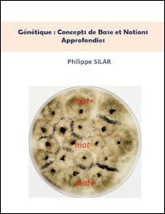
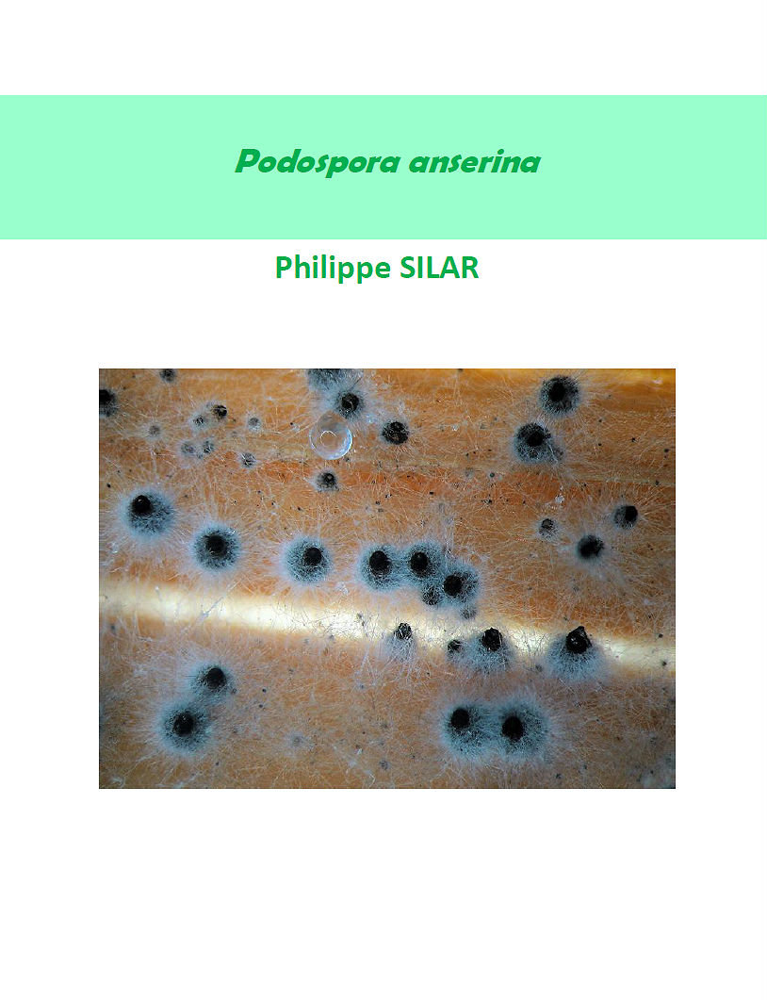
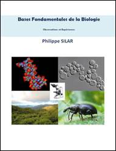
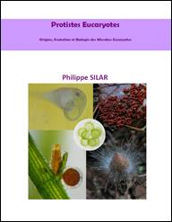

L'équipe GEC est constituée d'enseignants-chercheurs et est donc engagée dans la découverte de nouvelles connaissances ainsi que dans leur diffusion via un enseignement classique ou directement sur internet.

L'équipe GEC fait partie du [Laboratoire Interdisciplinaire des Energies de Demain](http://www.lied-pieri.univ-paris-diderot.fr/) (LIED, UMR 8236).

**Responsable de l'équipe:**
Professeur Philippe Silar 
Tel: (33) 1 57 27 84 72 
E-mail: [philippe.silar@univ-paris-diderot.fr](mailto:philippe.silar@univ-paris-diderot.fr)

**Mots clés:** mycologie, génétique et épigénétique, régulation/différentiation, énergie, déconstruction de la biomasse.

## Ressources scientifiques produites par le laboratoire

 



 

<b>A venir prochainement</b> 


<small>base de données en cours d'élaboration : pour avoir un aperçu, se connecter avec l'identifiant/mot de passe "guest"/"guest". </small>

## Diffusion des connaissances

**Nouveau et gratuit**

* le livre de Génétique (ISBN 978-2-9555841-3-2), en [version PDF](https://hal.archives-ouvertes.fr/hal-02921475) gratuite 
  

  **et toujours disponibles gratuitement**

* Le livre sur _Podospora anserina_ (ISBN 978-2-9555841-2-5), en [version PDF](https://hal.archives-ouvertes.fr/hal-02475488) gratuite 
  
   

* Le livre sur les _Bases Fondamentales de la Biologie_ (ISBN 978-2-9555841-1-8), en [version PDF](https://hal.archives-ouvertes.fr/hal-01401263) gratuite 
  

* Le livre de _Microbiologie eucaryote_ (ISBN 978-2-9555841-0-1), en [version PDF](https://hal.archives-ouvertes.fr/hal-01263138) gratuite 
  

 
- La création radiophonique de la RTBF: ['Une pour tous, tous par une' : une immersion dans l'univers méconnu des microbes, des bactéries, des champignons](https://www.rtbf.be/lapremiere/article/detail_une-pour-tous-tous-par-une-une-immersion-dans-l-univers-meconnu-des-microbes-des-bacteries-des-champignons?id=10015919)
- Le documentaire de France Culture sur les champignons: [Les champignons sortent du bois](https://www.franceculture.fr/emissions/lsd-la-serie-documentaire/les-champignons-sortent-du-bois-14-champignons-vos-papiers)

## Liens de téléchargements des cours pour les étudiants de l'Université de Paris

- Le cours online de [Génétique de Licence](http://gec.sdv.univ-paris-diderot.fr/cours/genetique/). Il reprend le cours en version PDF disponible [ici]( https://hal.archives-ouvertes.fr/hal-02921475). Ce cours contient encore des coquilles: merci de me les signaler... [ici](mailto:philippe.silar@univ-paris-diderot.fr)
- [Annales de M1](http://podo-gec.sdv.univ-paris-diderot.fr/examenmicrobioeuc.zip) (Archive zip)
- [cours de Génétique L3S5](http://podo-gec.sdv.univ-paris-diderot.fr/coursgénétiqueL3S5 5.pdf)
