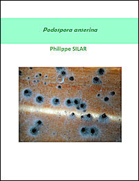

L'équipe GEC est maintenant fermée et ses membres encore actifs ont rejoint l'équipe [MICA](https://liedlab.net/microsystemes-cellulaires/) du [Laboratoire Interdisciplinaire des Energies de Demain](https://liedlab.net/) (LIED, UMR 8236). 
Cette page présente maintenant les projets de Philippe Silar, Valérie Gautier et Christophe Lalanne qui traite de la diversité des Sordariales.

## Diversité des Sordariales

contact: Professeur Philippe Silar 
Tel: (33) 1 57 27 84 72 
E-mail: [philippe.silar@u-paris.fr](mailto:philippe.silar@u-paris.fr)

**Mots clés:** mycologie, diversité fongique, Sordariales

nous développons un projet d’analyse de la biodiversité fongique en nous concentrant sur les espèces appartenant à l’ordre des Sordariales. Nous isolons des souches de Sordariales que nous caractérisons morphologiquement et moléculairement, avec pour les plus intéressantes d’entre elles l’établissement de la séquence complète des génomes. Nous collaborons sur plusieurs projets faisant appel à la diversité des Sordariales, principalement avec les Drs. Tatiana Giraud et Fanny Hartmann du [Laboratoire Écologie, Systématique et Évolution](https://www.ese.universite-paris-saclay.fr/) sur l'inhibition de la recombinaison autour du type sexuel chez les Sordariales, avec le Dr. Pierre Gladieux du [Plant Health Institute Montpellier](https://umr-phim.cirad.fr/) sur la phylogénie des Sordariales et le Dr. Narumon Tangthirasunun du [King Mongkut's Institute of Technology Ladkrabang](https://www.kmitl.ac.th/) sur la diversité des Sordariales.

## Ressources scientifiques produites par P. Silar

**gratuit**

* Le livre de _Microbiologie eucaryote_ - Seconde édition 2025 (ISBN 978-2-9555841-4-9), en [version PDF](https://hal.science/hal-05035918) gratuite 
  

* Le livre de Génétique (ISBN 978-2-9555841-3-2), en [version PDF](https://hal.archives-ouvertes.fr/hal-02921475) gratuite 
  

 * Le livre sur _Podospora anserina_ (ISBN 978-2-9555841-2-5), en [version PDF](https://hal.archives-ouvertes.fr/hal-02475488) gratuite 
  
   

* Le livre sur les _Bases Fondamentales de la Biologie_ (ISBN 978-2-9555841-1-8), en [version PDF](https://hal.archives-ouvertes.fr/hal-01401263) gratuite 
  

* Le livre de _Microbiologie eucaryote_ - Première édition 2016 (ISBN 978-2-9555841-0-1), en [version PDF](https://hal.archives-ouvertes.fr/hal-01263138) gratuite 
  

 

## Liens de téléchargements des cours pour les étudiants de l'Université de Paris Cité

- Le cours online de [Génétique de Licence](http://gec.sdv.univ-paris-diderot.fr/cours/genetique/). Il reprend le cours en version PDF disponible [ici]( https://hal.archives-ouvertes.fr/hal-02921475). Ce cours contient encore des coquilles: merci de me les signaler... [ici](mailto:philippe.silar@univ-paris-diderot.fr)
- [Annales de M1](https://github.com/podo-gec/podo-gec.github.io/blob/master/docs/examenmicrobioeuc.zip) (Archive zip)
- Le [cours de L3 IMVI](https://github.com/podo-gec/podo-gec.github.io/blob/master/docs/courslicenceIMVI.pdf)
